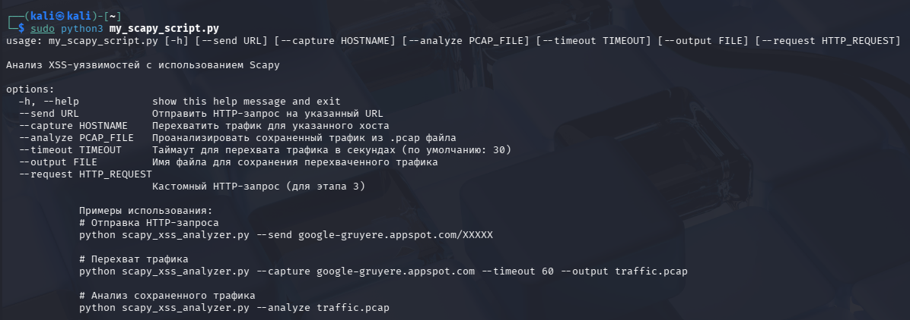
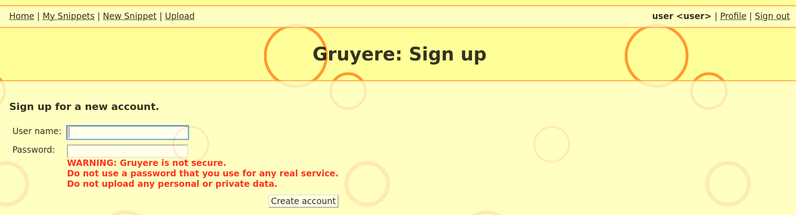
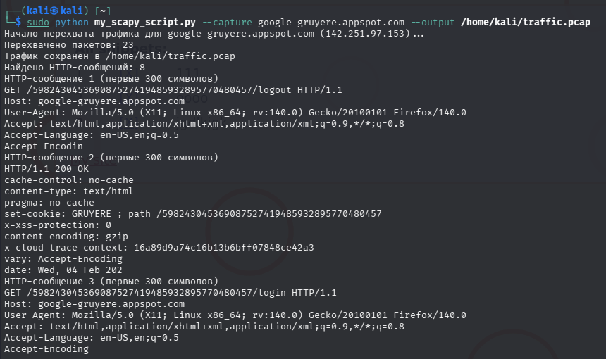
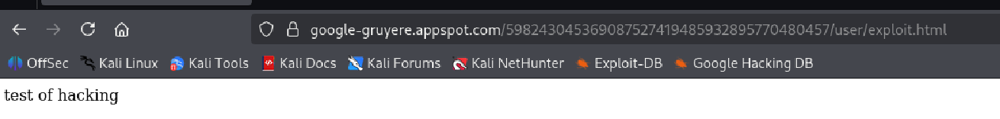
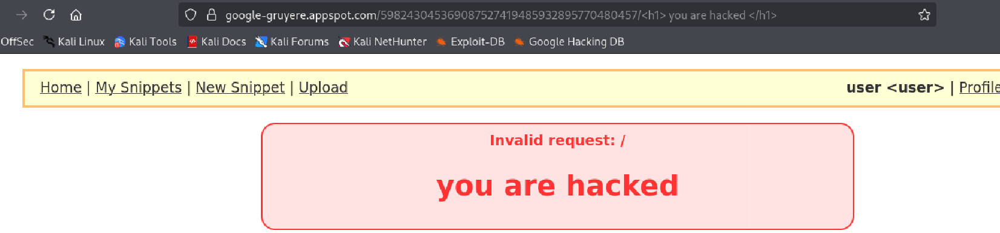
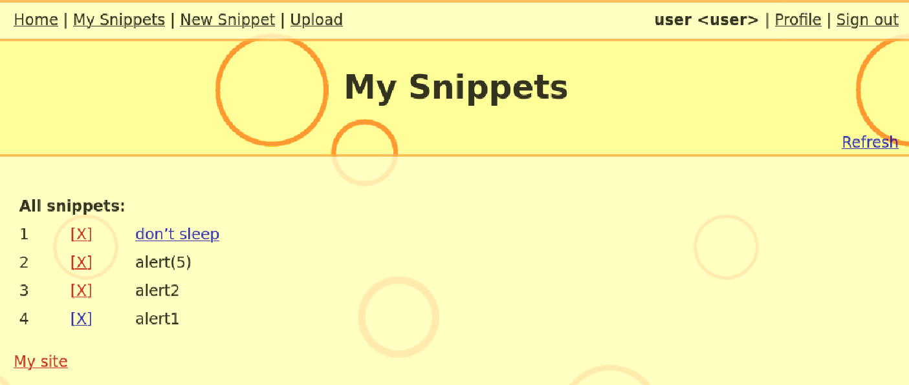
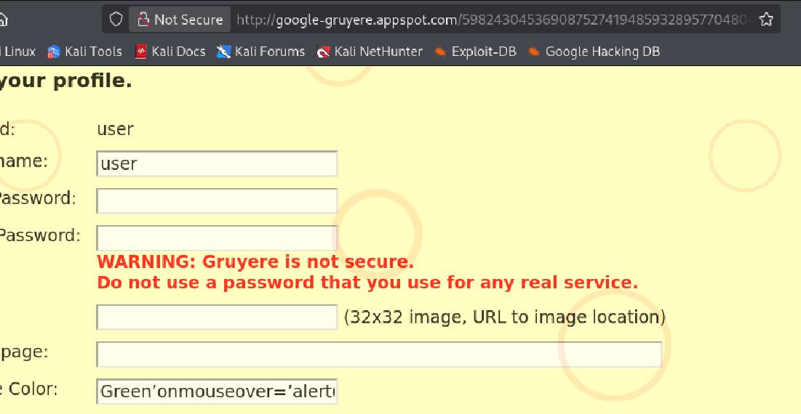
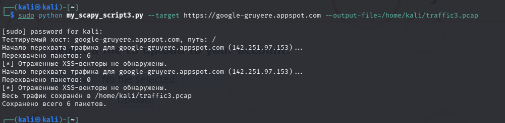
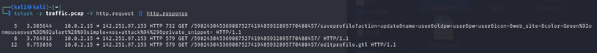

## Этап 1. Изучение Scapy

Цель: освоение базовых возможностей библиотеки Scapy.

1. Установка библиотеки Scapy:
   ```
   sudo apt update
   sudo apt install python3-scapy
   ```
2.   Отключение обработки RST-пакетов для предотвращения сбоя при захвате трафика:
   ```
   sudo iptables -A OUTPUT -p tcp --tcp-flags RST RST -j DROP

   ```

3. Запуск сценария Scapy с правами суперпользователя :
   

## Этап 2. Анализ трафика

Цель: изучение структуры HTTP-запросов и ответов.

Создали учетную запись на https://google-gruyere.appspot.com:



1. Для захвата трафика с помощью Scapy внесем изменения в скрипт в части def capture_traffic:

   ```
   def capture_traffic(hostname, timeout=30, output_file=None):
    """Перехватывает HTTP-трафик для указанного хоста."""
    dest_ip = resolve_hostname(hostname)
    if not dest_ip:
        return None
    
    print(f"Начало перехвата трафика для {hostname} ({dest_ip})...")
    
    # Настройка перехвата трафика
    packets = sniff(filter=f"host {dest_ip}", timeout=timeout)
    
    print(f"Перехвачено пакетов: {len(packets)}")
    
    if output_file and packets:
        wrpcap(output_file, packets)
        print(f"Трафик сохранен в {output_file}")
    
    return packets

   ```
   версия скрипта с изменениями:
2. Просмотр захваченных пакетов  непосредственно через Python:

   
    
3.  Анализ перехваченного трафика:

   

## Этап 3. Эксплуатация XSS
Анализ сайта Google Gruyere для поиска потенциальных точек внедрения XSS:
File upload XSS



Reflected XSS



Stored XSS



Stored XSS via HTML Attribut



 Использование скрипта для автоматизации тестирования 
  отправки различных XSS-полезных нагрузок .
 Скрипт: 


## Этап 4. Анализ результатов
Файл с перехваченым трафиком: [traffic.pcap](https://github.com/Mikhalkevich-N/DZ_8/blob/main/traffic.pcap)

1. Просмотр общего списка HTTP-запросов и ответов



2. Запрос с XSS-полезной нагрузкой:
```
GET /598243045369087527419485932895770480457/saveprofile?action=update&name=user&oldpw=user&pw=user&icon=&web_site=&color=Green%92onmouseover%3D%92alert%28%93simple+xss+attack%94%29&private_snippet= HTTP/1.1
```
Полезная нагрузка передается в параметре:

- color: Green'onmouseover='alert("simple xss attack")

Метод передачи:

- Использован метод GET, поскольку полезная нагрузка передана в строке запроса.

Описание Payload:

- Полезная нагрузка представляет собой HTML-код (onmouseover), который вызывает JavaScript-команду alert, выводящую сообщение "simple xss attack" при наведении мыши на элемент страницы.
  
Ответ сервера:
```
HTTP/1.1 302 Found
Location: http://google-gruyere.appspot.com/598243045369087527419485932895770480457
...
```
Отражение полезной нагрузки в ответе:

- Сервер перенаправляет клиента на новую страницу, и в данном ответе полезная нагрузка непосредственно не отображается в заголовках или теле ответа.

Однако важно отметить, что сервер отправляет статус код 302, означающий перенаправление, и вероятно, страница назначения включает полезную нагрузку в своём HTML-коде, вызывая потенциальную уязвимость.

Сравнение трафика

Изменения в структурах ответов:

- Обычный запрос (без атаки):
```
    HTTP/1.1 200 OK
  Content-Type: text/html
...
  
```

- Запрос с атакой:
```
  HTTP/1.1 302 Found
  Location: http://google-gruyere.appspot.com/598243045369087527419485932895770480457
...
```
Различия:

- Статус кода отличается (200 → 302).
- Появляется новый заголовок Location, перенаправляющий браузер на исходную страницу профиля.

Таким образом, отличие заключается в изменении статуса ответа и появлении перенаправления, вызванного наличием вредоносного кода в параметрах запроса.


